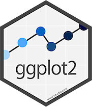
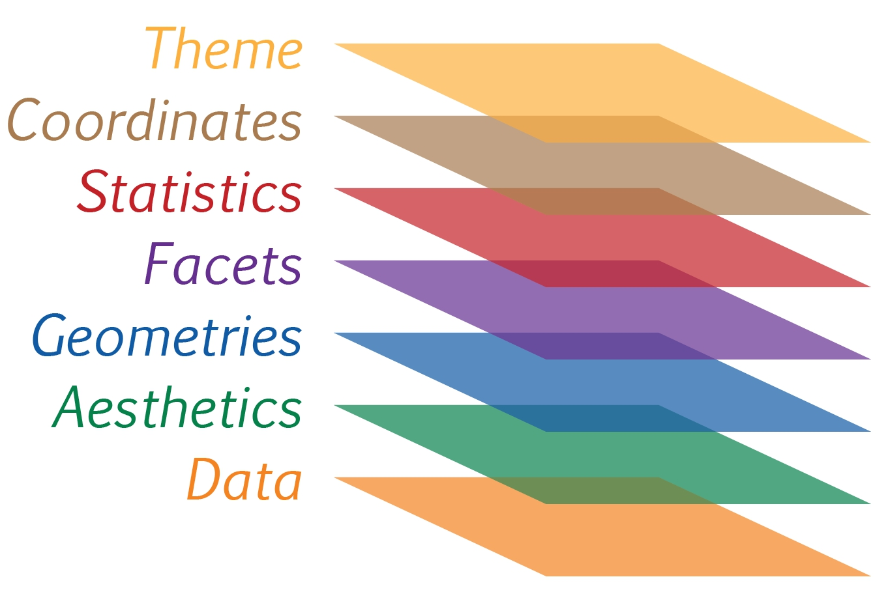
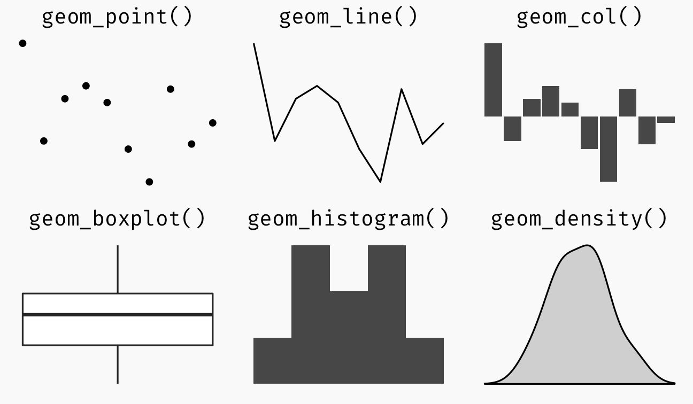

# Reflections

From this hands-on exercise, I learnt that ggplot2 is more than just a charting tool — it gives me a structured way to think about data visualisation. I now better understand how different components such as aesthetics, geoms, facets, coordinates, and themes work together to build clear and meaningful charts. This exercise also helped me become more familiar with choosing suitable chart types and customising them to communicate data more effectively.

# Getting Started

## Installing and loading the required libraries

The code chunk below uses p_load() of pacman package to check if tidyverse packages are installed in the computer. If they are, then they will be launched into R.

```{r}
pacman::p_load(tidyverse)
```

## Importing data

Next up, we will import the data

```{r}
exam_data <- read_csv("data/Exam_data.csv")
```

# What is ggplot?

{width="50"}is an R package for declaratively creating data-driven graphics based on ***The Grammar of Graphics.***

It is also part of the tidyverse family specially designed for visual exploration and communication.

## R Graphics VS ggplot

Here, we compare how R Graphics, the core graphical functions of Base R and ggplot plot a simple histogram

::: panel-tabset
## R Graphics

```{r}
hist(exam_data$MATHS)
```

## ggplot2

```{r}
ggplot(data=exam_data, aes(x = MATHS)) +
  geom_histogram(bins=10, 
                 boundary = 100,
                 color="black", 
                 fill="grey") +
  ggtitle("Distribution of Maths scores")
```
:::

From this, I learned that ggplot2 is not just a plotting tool but a structured way to think about visualisation, where data variables are systematically mapped to visual properties such as position, colour, and shape.

# Grammar of Graphics

I learned that the Grammar of Graphics is an important framework for data visualisation because it explains how statistical graphics are constructed from layered components and aesthetic mappings. This helped me better understand how different plot types are related and how meaningful visualisations are built in a systematic way.

## A Layered Grammar of Graphics

ggplot2 is an implementation of Leland Wilkinson’s Grammar of Graphics. Figure below shows the seven grammars of ggplot2.

{width="455"}

Reference: Hadley Wickham (2010) [“A layered grammar of graphics.”](https://vita.had.co.nz/papers/layered-grammar.html) *Journal of Computational and Graphical Statistics*, vol. 19, no. 1, pp. 3–28.

A ggplot2 visualisation is built from several key components. These include the data being plotted, aesthetic mappings that control how variables are shown visually, geometric objects such as bars or points, facets that split the data into multiple panels, statistical transformations that summarise the data, coordinate systems that determine how the plot is displayed, and themes that control the overall appearance of non-data elements

# ggplot2: data

Calling ggplot() with a dataset creates a blank plotting canvas and initializes a ggplot object. The data argument specifies which dataset will be used for the visualisation, and if the input is not already in a data frame format, ggplot2 will convert it into one.

```{r}
ggplot(data=exam_data)
```

# ggplot2: Aesthetic mappings

Aesthetic mappings are an essential part of ggplot2 because they define how variables in the dataset are represented visually. By using aes(), I can assign a variable to an axis or another visual property. In this example, mapping MATHS to the x-axis causes ggplot2 to display the x-axis and its corresponding label.

```{r}
ggplot(data=exam_data, 
       aes(x= MATHS))
```

# ggplot2: geom

Here are some definitions of geometric objects that I have learnt. Examples include:

-   *geom_point* for drawing individual points (e.g., a scatter plot)

-   *geom_line* for drawing lines (e.g., for a line charts)

-   *geom_smooth* for drawing smoothed lines (e.g., for simple trends or approximations)

-   *geom_bar* for drawing bars (e.g., for bar charts)

-   *geom_histogram* for drawing binned values (e.g. a histogram)

-   *geom_polygon* for drawing arbitrary shapes

-   *geom_map* for drawing polygons in the shape of a map! (You can access the data to use for these maps by using the map_data() function).



A plot must have at least one geom; there is no upper limit. We can add a geom to a plot using the **+** operator. For complete list, can refer to [here](https://ggplot2.tidyverse.org/reference/#section-layer-geoms).

## geom_bar

The code chunk below plots a bar chart by using geom_bar().

```{r}
ggplot(data=exam_data, 
       aes(x=RACE)) +
  geom_bar()
```

## geom_dotplot

-   geom_dotplot() is used to create a dot plot in ggplot2.
-   Each dot represents one observation in the dataset.
-   The dots are stacked to show the distribution of values.
-   The default y-axis in a dot plot is not very meaningful and can be misleading.
-   Removing the y-axis makes the plot clearer. Adjusting the binwidth improves how the dots are grouped and displayed.

```{r}
ggplot(data=exam_data, 
       aes(x = MATHS)) +
  geom_dotplot(binwidth=2.5,         
               dotsize = 0.5) +      
  scale_y_continuous(NULL,           
                     breaks = NULL)  
```

## geom_histogram()

Below code for geom_histogram() is used to create a simple histogram by using values in MATHS field of exam_data.

```{r}
ggplot(data=exam_data, 
       aes(x = MATHS)) +
  geom_histogram()
```

-   Default bin value is 30

## Learning how to modify a geometric object by changing **`geom()`**

-   *bins* argument is used to change the number of bins to 20,

-   *fill* argument is used to shade the histogram with light blue color, and

-   *color* argument is used to change the outline colour of the bars in black

```{r}
ggplot(data=exam_data, 
       aes(x= MATHS)) +
  geom_histogram(bins=20,            
                 color="black",      
                 fill="light blue")  
```

## Learning how to modify geometric object by changing **`aes()`**

We change the interior colour of the histogram (i.e. fill) by using sub-group of aesthetic(). Can use this method to colour, fill and alpha of the geometric.

```{r}
ggplot(data=exam_data, 
       aes(x= MATHS, 
           fill = GENDER)) +
  geom_histogram(bins=20, 
                 color="grey30")
```

## Geometric Objects: geom-density()

[`geom-density()`](https://ggplot2.tidyverse.org/reference/geom_density.html) computes and plots [kernel density estimate](https://en.wikipedia.org/wiki/Kernel_density_estimation), which is a smoothed version of the histogram

-   Useful alternative to the histogram for continuous data that comes from an underlying smooth distribution

-   The code below plots the distribution of Maths scores in a kernel density estimate plot.

```{r}
ggplot(data=exam_data, 
       aes(x = MATHS)) +
  geom_density()           
```

The code below plots two kernel density lines by using colour or fill arguments of aes()

```{r}
ggplot(data=exam_data, 
       aes(x = MATHS, 
           colour = GENDER)) +
  geom_density()
```

## Geometric Objects: geom_boxplot

[`geom_boxplot()`](https://ggplot2.tidyverse.org/reference/geom_boxplot.html) displays continuous value list. It visualises five summary statistics (the median, two hinges and two whiskers), and all “outlying” points individually.

The code chunk below plots boxplots by using [`geom_boxplot()`](https://ggplot2.tidyverse.org/reference/geom_boxplot.html).

```{r}
ggplot(data=exam_data, 
       aes(y = MATHS,       
           x= GENDER)) +    
  geom_boxplot()            
```

[**Notches**](https://sites.google.com/site/davidsstatistics/home/notched-box-plots) are used in box plots to help visually assess whether the medians of distributions differ - If notches do not overlap - medians are different

-   Below plots the distribution of Maths scores by gender in notched plot instead of boxplot.

```{r}
ggplot(data=exam_data, 
       aes(y = MATHS, 
           x= GENDER)) +
  geom_boxplot(notch=TRUE)
```

## Geometric Objects: geom_violin()

[`geom_violin`](https://ggplot2.tidyverse.org/reference/geom_violin.html) - Used to create violin plots - Useful for comparing multiple data distributions - Compared with ordinary density curves, violin plots are easier to compare when there are several groups - This is because the distributions are displayed side by side instead of overlapping as lines

Plot for the distribution of Maths score by gender in violin plot.

```{r}
ggplot(data=exam_data, 
       aes(y = MATHS, 
           x= GENDER)) +
  geom_violin()
```

## Geometric Objects: geom_point()

[`geom_point()`](https://ggplot2.tidyverse.org/reference/geom_point.html) - Useful for creating scatterplot.

Plot for scatterplot showing the Maths and English grades of pupils by using `geom_point()`.

```{r}
ggplot(data=exam_data, 
       aes(x= MATHS, 
           y=ENGLISH)) +
  geom_point()            
```

## geom objects can be combined

-   Plot the data points on the boxplots by using both `geom_boxplot()` and `geom_point()`.

```{r}
ggplot(data=exam_data, 
       aes(y = MATHS, 
           x= GENDER)) +
  geom_boxplot() +                    
  geom_point(position="jitter", 
             size = 0.5)        
```

# ggplot2: stat

[Statistics functions](https://ggplot2.tidyverse.org/reference/index.html#stats) - Statistically transform data, usually summary - frequency of values of a variable (bar graph) - a mean - a confidence limit

-   Two ways to use these functions:
    -   add a `stat_()` function and override the default geom, or
    -   add a `geom_()` function and override the default stat

## Working with stat()

Incomplete boxplot because the positions of the means were not shown

```{r}
ggplot(data=exam_data, 
       aes(y = MATHS, x= GENDER)) +
  geom_boxplot()
```

## Working with stat() - the stat_summary() method

Add mean values by using [`stat_summary()`](https://ggplot2.tidyverse.org/reference/stat_summary.html) function and overriding the default geom.

```{r}
ggplot(data=exam_data, 
       aes(y = MATHS, x= GENDER)) +
  geom_boxplot() +
  stat_summary(geom = "point",       
               fun = "mean",         
               colour ="red",        
               size=4)               
```

## Working with stat() - the geom() method

Add mean values by using `geom_()` function and overriding the default stat.

```{r}
ggplot(data=exam_data, 
       aes(y = MATHS, x= GENDER)) +
  geom_boxplot() +
  geom_point(stat="summary",        
             fun="mean",           
             colour="red",          
             size=4)          
```

## Adding a best fit curve on a scatterplot

 is used to plot a best fit curve on the scatterplot.](images/clipboard-248069833.png)

```{r}
ggplot(data=exam_data, 
       aes(x= MATHS, y=ENGLISH)) +
  geom_point() +
  geom_smooth(size=0.5)
```

The default smoothing method can be overridden as shown below.

```{r}
ggplot(data=exam_data, 
       aes(x= MATHS, 
           y=ENGLISH)) +
  geom_point() +
  geom_smooth(method=lm, 
              linewidth=0.5)
```

# ggplot2: Facets

-   Facetting generates small multiples (sometimes also called trellis plot), each displaying a different subset of the data
-   Alternative to aesthetics for displaying additional discrete variables. ggplot2 supports two types of facets, namely: [`facet_grid()`](https://ggplot2.tidyverse.org/reference/facet_grid.html) and [`facet_wrap`](https://ggplot2.tidyverse.org/reference/facet_wrap.html).

## Working with facet_wrap()

[`facet_wrap`](https://ggplot2.tidyverse.org/reference/facet_wrap.html) - Wraps a 1d sequence of panels into 2d - Better use of screen space than facet_grid because most displays are roughly rectangular

Below shows trellis plot using `facet-wrap()`.

```{r}
ggplot(data=exam_data, 
       aes(x= MATHS)) +
  geom_histogram(bins=20) +
    facet_wrap(~ CLASS)
```

## facet_grid() function

[`facet_grid()`](https://ggplot2.tidyverse.org/reference/facet_grid.html) - Forms a matrix of panels defined by row and column facetting variables - Most useful when you have two discrete variables, and all combinations of the variables exist in the data

Below plots a trellis plot using `facet_grid()`.

```{r}
ggplot(data=exam_data, 
       aes(x= MATHS)) +
  geom_histogram(bins=20) +
    facet_grid(~ CLASS)
```

# ggplot2: Coordinates

-   Map the position of objects onto the plane of the plot
-   Number of different possible coordinate systems to use

```         
-   [`coord_cartesian()`](https://ggplot2.tidyverse.org/reference/coord_cartesian.html): the default cartesian coordinate systems, where you specify x and y values (e.g. allows you to zoom in or out). 
-   [`coord_flip()`](https://ggplot2.tidyverse.org/reference/coord_flip.html): a cartesian system with the x and y flipped. 
-   [`coord_fixed()`](https://ggplot2.tidyverse.org/reference/coord_fixed.html): a cartesian system with a "fixed" aspect ratio (e.g. 1.78 for a "widescreen" plot). 
-   [`coord_quickmap()`](https://ggplot2.tidyverse.org/reference/coord_map.html): a coordinate system that approximates a good aspect ratio for maps.
```

## Working with Coordinate

By the default, the bar chart of ggplot2 is vertical

```{r}
ggplot(data=exam_data, 
       aes(x=RACE)) +
  geom_bar()
```

Below flips the horizontal bar chart into vertical bar chart by using `coord_flip()`.

```{r}
ggplot(data=exam_data, 
       aes(x=RACE)) +
  geom_bar() +
  coord_flip()
```

## Changing the y-and x-axis range

y-axis and x-axis range are not equal

```{r}
ggplot(data=exam_data, 
       aes(x= MATHS, y=ENGLISH)) +
  geom_point() +
  geom_smooth(method=lm, size=0.5)
```

Fixed both the y-axis and x-axis range from 0-100.

```{r}
ggplot(data=exam_data, 
       aes(x= MATHS, y=ENGLISH)) +
  geom_point() +
  geom_smooth(method=lm, 
              size=0.5) +  
  coord_cartesian(xlim=c(0,100),
                  ylim=c(0,100))
```

# ggplot2: themes

A list of theme can be found at this [link](https://ggplot2.tidyverse.org/reference/ggtheme.html).

## Working with theme

The code chunk below plot a horizontal bar chart using `theme_gray()`.

```{r}
ggplot(data=exam_data, 
       aes(x=RACE)) +
  geom_bar() +
  coord_flip() +
  theme_gray()
```

A horizontal bar chart plotted using `theme_classic()`.

```{r}
ggplot(data=exam_data, 
       aes(x=RACE)) +
  geom_bar() +
  coord_flip() +
  theme_classic()
```

A horizontal bar chart plotted using `theme_minimal()`.

```{r}
ggplot(data=exam_data, 
       aes(x=RACE)) +
  geom_bar() +
  coord_flip() +
  theme_minimal()
```

# Credits

-   Hadley Wickham (2023) [**ggplot2: Elegant Graphics for Data Analysis**](https://ggplot2-book.org/). Online 3rd edition.

-   Winston Chang (2013) [**R Graphics Cookbook 2nd edition**](https://r-graphics.org/). Online version.

-   Healy, Kieran (2019) [**Data Visualization: A practical introduction**](https://socviz.co/). Online version

-   [Learning ggplot2 on Paper – Components](https://henrywang.nl/learning-ggplot2-on-paper-components/)

-   [Learning ggplot2 on Paper – Layer](https://henrywang.nl/learning-ggplot2-on-paper-layer/)

-   [Learning ggplot2 on Paper – Scale](https://henrywang.nl/tag/learning-ggplot2-on-paper/)
