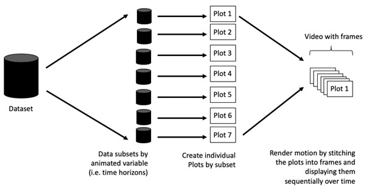

# Reflections

From this exercise, I learned how to create animated and interactive visualisations using **gganimate** and **plotly** in R. I learned that animations are built by stitching multiple plot frames together to show changes over time. I also practised preparing data with **dplyr** and **tidyr** before visualising it. Overall, this exercise showed me how animation can make data storytelling more engaging and useful, especially when presenting trends over time.

# Introduction

This hands-on exercise focuses on creating animated and interactive data visualisations to make data stories more engaging and memorable compared to static graphics. It introduces the use of gganimate and plotly in R to build animated visuals, while also strengthening data preparation skills through tidyr for reshaping data and dplyr for processing, wrangling, and transforming datasets before visualisation.

## Basic concept of animation

Animations are created by generating many individual plots and stitching them together like a flip book. Each frame uses a subset of the data, creating the illusion of movement when played in sequence.



## Terminology

1.  **Frame**: In an animated line graph, each frame represents a different point in time or a different category. When the frame changes, the data points on the graph are updated to reflect the new data.

2.  **Animation Attributes**: The animation attributes are the settings that control how the animation behaves. For example, you can specify the duration of each frame, the easing function used to transition between frames, and whether to start the animation from the current frame or from the beginning.

Food for thought:

Does it makes sense to go through the effort? If conducting an exploratory data analysis, a animated graphic may not be worth the time investment. If you are giving a presentation, a few well-placed animated graphics can help an audience connect with your topic remarkably better than static counterparts.

# Getting started

## Loading the R packages

-   [**plotly**](https://plotly.com/r/), R library for plotting interactive statistical graphs.

-   [**gganimate**](https://gganimate.com/), an ggplot extension for creating animated statistical graphs.

-   [**gifski**](https://cran.r-project.org/web/packages/gifski/index.html) converts video frames to GIF animations using pngquant’s fancy features for efficient cross-frame palettes and temporal dithering. It produces animated GIFs that use thousands of colors per frame.

-   [**gapminder**](https://cran.r-project.org/web/packages/gapminder/index.html): An excerpt of the data available at Gapminder.org. We just want to use its *country_colors* scheme.

-   [**tidyverse**](https://www.tidyverse.org/), a family of modern R packages specially designed to support data science, analysis and communication task including creating static statistical graphs.

```{r}
pacman::p_load(readxl, gifski, gapminder,
               plotly, gganimate, tidyverse)
```

## Importing the data

*Data* worksheet from *GlobalPopulation* Excel workbook will be used.

Below code chunk is to import Data worksheet from GlobalPopulation Excel workbook by using appropriate R package from tidyverse family

```{r}
col <- c("Country", "Continent")
globalPop <- read_xls("data/GlobalPopulation.xls",
                      sheet="Data") %>%
  mutate_at(col, as.factor) %>%
  mutate(Year = as.integer(Year))
```

Instead of using `mutate_at()`, [`across()`](https://dplyr.tidyverse.org/reference/across.html) can be used to derive the same outputs.

```{r}
col <- c("Country", "Continent")
globalPop <- read_xls("data/GlobalPopulation.xls",
                      sheet="Data") %>%
  mutate(across(col, as.factor)) %>%
  mutate(Year = as.integer(Year))
```

# Animated data visualisation: gganimate methods

[**gganimate**](https://gganimate.com/) extends the grammar of graphics as implemented by ggplot2 to include the description of animation. It does this by providing a range of new grammar classes that can be added to the plot object in order to customise how it should change with time.

-   `transition_*()` defines how the data should be spread out and how it relates to itself across time.

-   `view_*()` defines how the positional scales should change along the animation.

-   `shadow_*()` defines how data from other points in time should be presented in the given point in time.

-   `enter_*()/exit_*()` defines how new data should appear and how old data should disappear during the course of the animation.

-   `ease_aes()` defines how different aesthetics should be eased during transitions.

## Building static population bubble plot

::: panel-tabset
## The plot

Basic ggplot2 functions are used to create a static bubble plot.

```{r}
ggplot(globalPop, aes(x = Old, y = Young, 
                      size = Population, 
                      colour = Country)) +
  geom_point(alpha = 0.7, 
             show.legend = FALSE) +
  scale_colour_manual(values = country_colors) +
  scale_size(range = c(2, 12)) +
  labs(title = 'Year: {frame_time}', 
       x = '% Aged', 
       y = '% Young') 
```

## The code

```{r}
ggplot(globalPop, aes(x = Old, y = Young, 
                      size = Population, 
                      colour = Country)) +
  geom_point(alpha = 0.7, 
             show.legend = FALSE) +
  scale_colour_manual(values = country_colors) +
  scale_size(range = c(2, 12)) +
  labs(title = 'Year: {frame_time}', 
       x = '% Aged', 
       y = '% Young') 
```
:::

## Building the animated bubble plot

::: panel-tabset
## The animated bubble chart

```{r}
ggplot(globalPop, aes(x = Old, y = Young, 
                      size = Population, 
                      colour = Country)) +
  geom_point(alpha = 0.7, 
             show.legend = FALSE) +
  scale_colour_manual(values = country_colors) +
  scale_size(range = c(2, 12)) +
  labs(title = 'Year: {frame_time}', 
       x = '% Aged', 
       y = '% Young') +
  transition_time(Year) +       
  ease_aes('linear')          
```

## The code

```{r}
ggplot(globalPop, aes(x = Old, y = Young, 
                      size = Population, 
                      colour = Country)) +
  geom_point(alpha = 0.7, 
             show.legend = FALSE) +
  scale_colour_manual(values = country_colors) +
  scale_size(range = c(2, 12)) +
  labs(title = 'Year: {frame_time}', 
       x = '% Aged', 
       y = '% Young') +
  transition_time(Year) +       
  ease_aes('linear')          
```
:::

# Animated Data Visualisation: plotly

In **Plotly R** package, both `ggplotly()` and `plot_ly()` support key frame animations through the `frame` argument/aesthetic. They also support an `ids` argument helps match same objects across frames, making animation transitions smoother and more consistent

## Building animated bubble plot: ggplotly() method

::: panel-tabset
## The animated bubble chart

```{r}
gg <- ggplot(globalPop, 
       aes(x = Old, 
           y = Young, 
           size = Population, 
           colour = Country)) +
  geom_point(aes(size = Population,
                 frame = Year),
             alpha = 0.7, 
             show.legend = FALSE) +
  scale_colour_manual(values = country_colors) +
  scale_size(range = c(2, 12)) +
  labs(x = '% Aged', 
       y = '% Young')

ggplotly(gg)        
```

The animated bubble plot above includes a play/pause button and a slider component for controlling the animation

## The code

```{r}
gg <- ggplot(globalPop, 
       aes(x = Old, 
           y = Young, 
           size = Population, 
           colour = Country)) +
  geom_point(aes(size = Population,
                 frame = Year),
             alpha = 0.7, 
             show.legend = FALSE) +
  scale_colour_manual(values = country_colors) +
  scale_size(range = c(2, 12)) +
  labs(x = '% Aged', 
       y = '% Young')

ggplotly(gg)        
```

Appropriate ggplot2 functions are used to create a static bubble plot. The output is then saved as an R object called gg. ggplotly() is then used to convert the R graphic object into an animated svg object.
:::

Notice that although show.legend = FALSE argument was used, the legend still appears on the plot. To overcome this problem, theme(legend.position='none') should be used as shown in the plot and code chunk below.

::: panel-tabset
## The plot

```{r}
gg <- ggplot(globalPop, 
       aes(x = Old, 
           y = Young, 
           size = Population, 
           colour = Country)) +
  geom_point(aes(size = Population,
                 frame = Year),
             alpha = 0.7) +
  scale_colour_manual(values = country_colors) +
  scale_size(range = c(2, 12)) +
  labs(x = '% Aged', 
       y = '% Young') + 
  theme(legend.position='none')

ggplotly(gg)
```

## The code

```{r}
gg <- ggplot(globalPop, 
       aes(x = Old, 
           y = Young, 
           size = Population, 
           colour = Country)) +
  geom_point(aes(size = Population,
                 frame = Year),
             alpha = 0.7) +
  scale_colour_manual(values = country_colors) +
  scale_size(range = c(2, 12)) +
  labs(x = '% Aged', 
       y = '% Young') + 
  theme(legend.position='none')

ggplotly(gg)
```
:::

## Building an animated bubble plot: plot_ly() method

Create an animated bubble plot by using plot_ly() method.

::: panel-tabset
## The plot

```{r}
bp <- globalPop %>%
  plot_ly(x = ~Old, 
          y = ~Young, 
          size = ~Population, 
          color = ~Continent,
          sizes = c(2, 100),
          frame = ~Year, 
          text = ~Country, 
          hoverinfo = "text",
          type = 'scatter',
          mode = 'markers'
          ) %>%
  layout(showlegend = FALSE)
bp
```

## The code

```{r}
bp <- globalPop %>%
  plot_ly(x = ~Old, 
          y = ~Young, 
          size = ~Population, 
          color = ~Continent,
          sizes = c(2, 100),
          frame = ~Year, 
          text = ~Country, 
          hoverinfo = "text",
          type = 'scatter',
          mode = 'markers'
          ) %>%
  layout(showlegend = FALSE)
bp
```
:::

# Reference

-   [Getting Started](https://gganimate.com/articles/gganimate.html)

-   Visit this [link](https://rpubs.com/raymondteo/dataviz8) for a very interesting implementation of gganimate by your senior.

-   [Building an animation step-by-step with gganimate](https://www.alexcookson.com/post/2020-10-18-building-an-animation-step-by-step-with-gganimate/).

-   [Creating a composite gif with multiple gganimate panels](https://solarchemist.se/2021/08/02/composite-gif-gganimate/)
