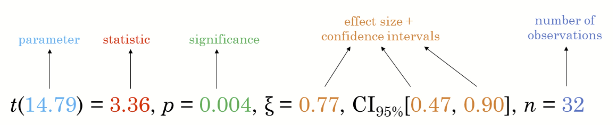
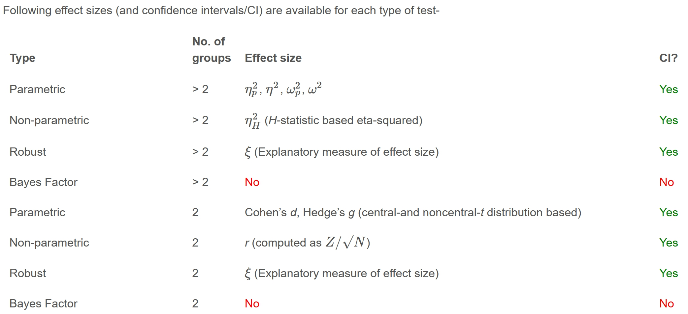

# Reflections

In this exercise, I learnt how to use ggstatsplot to create visualisations that include both charts and statistical test results. I also learnt how to compare groups, test relationships between variables, and interpret results such as p-values, Bayes Factor, and significance levels. Overall, this helped me understand how visual analytics can make statistical findings easier to communicate and interpret.

# Introduction

Will gain hands-on experience using

-   ggstatsplot package to create visual graphics with rich statistical information,

-   performance package to visualise model diagnostics, and

-   parameters package to visualise model parameters

[**ggstatsplot**](https://indrajeetpatil.github.io/ggstatsplot/index.html) {width="50" height="50"} is an extension of [**ggplot2**](https://ggplot2.tidyverse.org/) package for creating graphics with details from statistical tests included in the information-rich plots themselves.



# Getting started

## Installing and loading R packages

**ggstatsplot** and **tidyverse** will be used.

```{r}
pacman::p_load(ggstatsplot, tidyverse)
```

## Data importing

We will be using Exam_data.csv for this exercise. The read_csv() used in previous exercises is used to import

```{r}
exam <- read_csv("data/Exam_data.csv")
```

## One-sample test: gghistostats() method

In the code chunk below, [*gghistostats()*](https://indrajeetpatil.github.io/ggstatsplot/reference/gghistostats.html) is used to build an visual of one-sample test on English scores.

If not working, please run this code

```{r}
install.packages("ggstatsplot")
library(ggstatsplot)
```

```{r}
set.seed(1234)

gghistostats(
  data = exam,
  x = ENGLISH,
  type = "bayes",
  test.value = 60,
  xlab = "English scores"
)
```

Default information: - statistical details - Bayes Factor - sample sizes - distribution summary

## Unpacking the Bayes Factor

-   **Bayes Factor** compares how strongly the data supports one hypothesis over another.

<!-- -->

-   It helps us understand whether the evidence is stronger for the **alternative hypothesis (H1)** or the **null hypothesis (H0)**.

<!-- -->

-   In simple terms, it tells us the **weight of evidence** in favour of a particular hypothesis.


-   The [**Schwarz criterion**](https://www.statisticshowto.com/bayesian-information-criterion/) is one of the easiest ways to calculate rough approximation of the Bayes Factor

## Interpreting Bayes Factor

Bayes Factor can be any positive number. One of the most common interpretations is this one—first proposed by Harold Jeffereys (1961) and slightly modified by [Lee and Wagenmakers](https://www-tandfonline-com.libproxy.smu.edu.sg/doi/pdf/10.1080/00031305.1999.10474443?needAccess=true) in 2013:


## Two-sample mean test: ggbetweenstats()

In the code chunk below, [*ggbetweenstats()*](https://indrajeetpatil.github.io/ggstatsplot/reference/ggbetweenstats.html) is used to build a visual for two-sample mean test of Maths scores by gender.

::: panel-tabset
## The plot

```{r}
ggbetweenstats(
  data = exam,
  x = GENDER, 
  y = MATHS,
  type = "np",
  messages = FALSE
)
```

## The code

```{r}
ggbetweenstats(
  data = exam,
  x = GENDER, 
  y = MATHS,
  type = "np",
  messages = FALSE
)
```
:::

Default information: - statistical details - Bayes Factor - sample sizes - distribution summary

## Oneway ANOVA Test: ggbetweenstats() method

In the code chunk below, [*ggbetweenstats()*](https://indrajeetpatil.github.io/ggstatsplot/reference/ggbetweenstats.html) is used to build a visual for One-way ANOVA test on English score by race.

::: panel-tabset
## The plot

```{r}
ggbetweenstats(
  data = exam,
  x = RACE, 
  y = ENGLISH,
  type = "p",
  mean.ci = TRUE, 
  pairwise.comparisons = TRUE, 
  pairwise.display = "s",
  p.adjust.method = "fdr",
  messages = FALSE
)
```

## The code

```{r}
ggbetweenstats(
  data = exam,
  x = RACE, 
  y = ENGLISH,
  type = "p",
  mean.ci = TRUE, 
  pairwise.comparisons = TRUE, 
  pairwise.display = "s",
  p.adjust.method = "fdr",
  messages = FALSE
)
```
:::

"ns" refers to only non-significant

"s" only significant

"all" everything

### ggbetweenstats - Summary of tests





## Significant Test of Correlation: ggscatterstats()

In the code chunk below, [*ggscatterstats()*](https://indrajeetpatil.github.io/ggstatsplot/reference/ggscatterstats.html) is used to build a visual for Significant Test of Correlation between Maths scores and English scores.

::: panel-tabset
## The plot

```{r}
ggscatterstats(
  data = exam,
  x = MATHS,
  y = ENGLISH,
  marginal = FALSE,
  )       
```

## The code

```{r}
ggscatterstats(
  data = exam,
  x = MATHS,
  y = ENGLISH,
  marginal = FALSE,
  )       
```
:::

## Significant Test of Association (Dependence) : ggbarstats() methods

In the code chunk below, the Maths scores are binned into a 4-class variable by using [*cut()*](https://www.rdocumentation.org/packages/base/versions/3.6.2/topics/cut).

```{r}
exam1 <- exam %>% 
  mutate(MATHS_bins = 
           cut(MATHS, 
               breaks = c(0,60,75,85,100))
)      
```


In this code chunk below [*ggbarstats()*](https://indrajeetpatil.github.io/ggstatsplot/reference/ggbarstats.html) is used to build a visual for Significant Test of Association

::: panel-tabset
## The plot

```{r}
ggbarstats(exam1, 
           x = MATHS_bins, 
           y = GENDER)
```

## The code

```{r}
ggbarstats(exam1, 
           x = MATHS_bins, 
           y = GENDER)
```
:::
