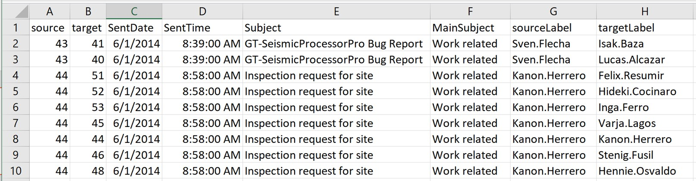
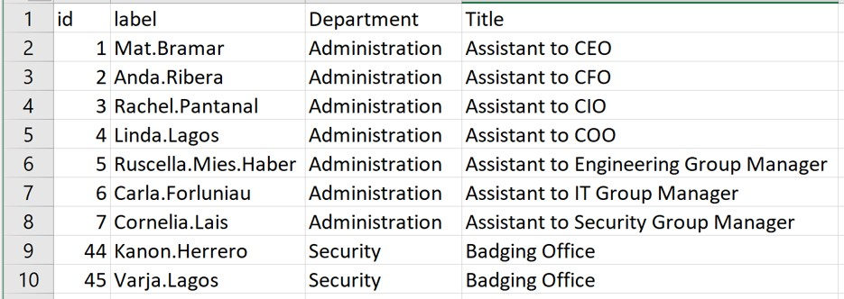
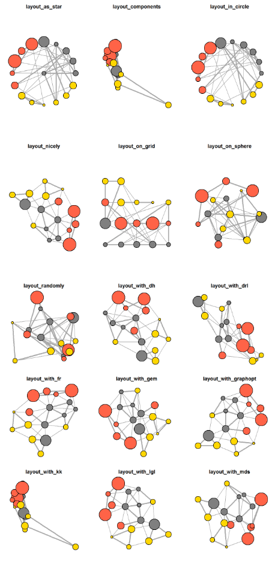

# Reflections

This hands-on exercise helped me understand how network data can be modelled using nodes and edges, instead of just normal rows and columns. I learnt how tidygraph and ggraph can be used to build and visualise relationships. The use of centrality and community detection also showed me how network metrics can identify important actors and groups within a system. Overall, I found this useful because it connects data wrangling, visualisation, and analysis into one workflow for exploring complex relationships.

# Introduction

This hands-on exercise introduces how to use R to model, analyse, and visualise network data. It covers how to create graph data, manipulate network relationships, calculate network metrics, and build both static and interactive network visualisations using packages such as **tidygraph**, **ggraph**, and **visNetwork**.

# Getting started

## Installing and loading R packages

The required R packages are installed and loaded for network data modelling and visualisation. The main network packages used are **igraph**, **tidygraph**, **ggraph**, and **visNetwork**. Other supporting packages such as **tidyverse**, **lubridate**, **clock**, **graphlayouts**, **concaveman**, and **ggforce** are also loaded to support data wrangling, date-time handling, graph layouts, and advanced network visualisation.

```{r}
pacman::p_load(igraph, tidygraph, ggraph,
               visNetwork, lubridate, clock,
               tidyverse, graphlayouts,
               concaveman, ggforce)
```

# The Data

The data sets used in this exercise is from an oil exploration and extraction company. There are two data sets. One contains the nodes data and the other contains the edges (also know as link) data.

## Edges Data

GAStech-email_edges.csv - this file consists of two weeks of 9063 emails correspondences between 55 employees.



## Nodes Data

GAStech_email_nodes.csv - this file consist of the names, department and title of the 55 employees.



## Importing network data from files

In this step we will import GAStech_email_node.csv and GAStech_email_edges-v2.csv into RStudio environment by using read_csv() of **readr** package.

```{r}
GAStech_nodes <- read_csv("data/GAStech_email_node.csv")
GAStech_edges <- read_csv("data/GAStech_email_edge-v2.csv")
```

## Reveiwing imported data

Next, we will examine the structure of the data frame using **glimpse()** of dplyr.

```{r}
glimpse(GAStech_edges)
```

We can see that SentDate is treated as “Character” data type instead of date data type. This is an error. Before we continue, it is important for us to change the data type of SentDate field back to “Date”” data type.

## Data wrangling

Code chunk below will be used for data wrangling.

```{r}
GAStech_edges <- GAStech_edges %>%
  mutate(SendDate = dmy(SentDate)) %>%
  mutate(Weekday = wday(SentDate,
                        label = TRUE,
                        abbr = FALSE))
```

**Important to note:**

-   both dmy() and wday() are functions of lubridate package. lubridate is an R package that makes it easier to work with dates and times.

-   dmy() transforms the SentDate to Date data type.

-   wday() returns the day of the week as a decimal number or an ordered factor if label is TRUE.

-   The argument abbr is FALSE keep the daya spells in full (Monday)

-   The function will create a new column in the data.frame (Weekday and the output of wday() will save in this newly created field)

-   Values in the Weekday field are in ordinal scale

## Reviewing revised date fields

Table below shows the data structure of the reformatted GAStech_edges data frame

Rows: 9,063 Columns: 10 \$ source <dbl> 43, 43, 44, 44, 44, 44, 44, 44, 44, 44, 44, 44, 26, 26, 26… \$ target <dbl> 41, 40, 51, 52, 53, 45, 44, 46, 48, 49, 47, 54, 27, 28, 29… \$ SentDate <chr> "6/1/2014", "6/1/2014", "6/1/2014", "6/1/2014", "6/1/2014"… \$ SentTime <time> 08:39:00, 08:39:00, 08:58:00, 08:58:00, 08:58:00, 08:58:0… \$ Subject <chr> "GT-SeismicProcessorPro Bug Report", "GT-SeismicProcessorP… \$ MainSubject <chr> "Work related", "Work related", "Work related", "Work rela… \$ sourceLabel <chr> "Sven.Flecha", "Sven.Flecha", "Kanon.Herrero", "Kanon.Herr… \$ targetLabel <chr> "Isak.Baza", "Lucas.Alcazar", "Felix.Resumir", "Hideki.Coc… \$ SendDate <date> 2014-01-06, 2014-01-06, 2014-01-06, 2014-01-06, 2014-01-0… \$ Weekday <ord> Friday, Friday, Friday, Friday, Friday, Friday, Friday, Fr…

## Wrangling attributes

The **GAStech_edges** data contains individual email records. Since this can be too detailed for visualisation, the records are grouped by date, sender, receiver, main subject, and weekday to create a clearer summary of the email flow.

**Code chunk:**

```{r}
GAStech_edges_aggregated <- GAStech_edges %>%
  filter(MainSubject == "Work related") %>%
  group_by(source, target, Weekday) %>%
    summarise(Weight = n()) %>%
  filter(source!=target) %>%
  filter(Weight > 1) %>%
  ungroup()
```

**Important to note:**

-   four functions namely *filter()*, *group()*, *summarise()*, and *ungroup()* from **dplyr** package are used

-   The output data.frame is called **GAStech_edges_aggregated**

-   A new field called *Weight* has been added in GAStech_edges_aggregated

## Reviewing revised edges file

The table below shows the data structure of the aggregated `GAStech_edges` data frame.

```{r}
glimpse(GAStech_edges_aggregated)
```

# Creating network objects using tidygraph

In this section, `tidygraph` is used to create a graph data model for network analysis. Network data can be understood as two connected tables: one for nodes and one for edges. The `tidygraph` package makes it easier to work with these tables by allowing us to switch between node and edge data, while still using familiar `dplyr` functions to manipulate them. It also provides access to graph algorithms, which can be useful for analysing network structures in a tidy workflow.

**Good reads:**

-   [Introducing tidygraph](https://www.data-imaginist.com/2017/introducing-tidygraph/)

-   [tidygraph 1.1 - A tidy hope](https://www.data-imaginist.com/2018/tidygraph-1-1-a-tidy-hope/)

## The tbl_graph object

The tbl_graph object is used in `tidygraph` to create and store network data. There are two main functions: `tbl_graph()`, which builds a network object using node and edge data, and `as_tbl_graph()`, which converts other data formats or network objects into a `tbl_graph` object. This makes it easier to work with different types of network data in a tidy format.

`as_tbl_graph()` is useful because it can convert many different types of network-related data into a tbl_graph object. This includes node and edge data frames, base R objects such as data frames, lists and matrices, as well as existing network objects from packages such as igraph, network, data.tree, ape, and Bioconductor. This makes it flexible for working with network data from different sources.

## The dplyr verbs in tidygraph

`activate()` verb from **tidygraph** serves as a switch between tibbles for nodes and edges. All dplyr verbs applied to **tbl_graph** object are applied to the active tibble.


The *.N()* function is used to gain access to the node data while manipulating the edge data. Similarly *.E()* will give you the edge data and *.G()* will give you the **tbl_graph** object itself.

## Using tbl_graph() to build tidygraph data model

In this section, we use `tbl_graph()` of **tinygraph** package to build an tidygraph’s network graph data.frame.

Before typing the codes, it is recommended to review to reference guide of [`tbl_graph()`](https://tidygraph.data-imaginist.com/reference/tbl_graph.html)

```{r}
GAStech_graph <- tbl_graph(nodes = GAStech_nodes,
                           edges = GAStech_edges_aggregated, 
                           directed = TRUE)
```

## Reviewing the output tidygraph’s graph object

```{r}
GAStech_graph
```

## Reviewing the output tidygraph’s graph object

-   The output above reveals that *GAStech_graph* is a tbl_graph object with 54 nodes and 4541 edges.

-   The command also prints the first six rows of “Node Data” and the first three of “Edge Data”.

-   It states that the Node Data is **active**. The notion of an active tibble within a tbl_graph object makes it possible to manipulate the data in one tibble at a time.

## Changing active object

The node table is selected by default in a `tbl_graph` object. However, we can use the `activate()` function to switch between the node table and edge table. For example, if we want to work with the edge data and sort the connections by the highest `Weight`, we can activate the edges first, then use `arrange()` to reorder the rows.

```{r}
GAStech_graph %>%
  activate(edges) %>%
  arrange(desc(Weight))
```

*Visit [activate()](https://tidygraph.data-imaginist.com/reference/activate.html)* to find out more about the function

# Plotting Static Network Graphs with ggraph package

[**ggraph**](https://ggraph.data-imaginist.com/) is an extension of **ggplot2**, making it easier to carry over basic ggplot skills to the design of network graphs.

As in all network graph, there are three main aspects to a **ggraph**’s network graph, they are:

-   [nodes](https://cran.r-project.org/web/packages/ggraph/vignettes/Nodes.html),

-   [edges](https://cran.r-project.org/web/packages/ggraph/vignettes/Edges.html) and

-   [layouts](https://cran.r-project.org/web/packages/ggraph/vignettes/Layouts.html).

For a comprehensive discussion of each of this aspect of graph, please refer to their respective vignettes provided.

## Plotting a basic network graph

The code chunk below uses [*ggraph()*](https://ggraph.data-imaginist.com/reference/ggraph.html), [*geom-edge_link()*](https://ggraph.data-imaginist.com/reference/geom_edge_link.html) and [*geom_node_point()*](https://ggraph.data-imaginist.com/reference/geom_node_point.html) to plot a network graph by using *GAStech_graph*. Before getting started, it is advised to read their respective reference guide at least once.

```{r}
ggraph(GAStech_graph) +
  geom_edge_link() +
  geom_node_point()
```

-   The basic plotting function is `ggraph()`, which takes the data to be used for the graph and the type of layout desired. Both of the arguments for `ggraph()` are built around *igraph*. Therefore, `ggraph()` can use either an *igraph* object or a *tbl_graph* object.

## Changing the default network graph theme

In this section, we will use [*theme_graph()*](https://ggraph.data-imaginist.com/reference/theme_graph.html) to remove the x and y axes. Before we get started, it is advisable to read it’s reference guide at least once.

```{r}
g <- ggraph(GAStech_graph) + 
  geom_edge_link(aes()) +
  geom_node_point(aes())

g + theme_graph()
```

-   **ggraph** introduces a special ggplot theme that provides better defaults for network graphs than the normal ggplot defaults. `theme_graph()`, besides removing axes, grids, and border, changes the font to Arial Narrow (this can be overridden)

-   The ggraph theme can be set for a series of plots with the `set_graph_style()` command run before the graphs are plotted or by using `theme_graph()` in the individual plots

## Changing coloring of the plot

theme_graph() makes it easy to change the coloring of the plot.

```{r}
g <- ggraph(GAStech_graph) + 
  geom_edge_link(aes(colour = 'grey50')) +
  geom_node_point(aes(colour = 'grey40'))

g + theme_graph(background = 'grey10',
                text_colour = 'white')
```

## Working with ggraph's layouts

**ggraph** support many layout for standard used, they are: star, circle, nicely (default), dh, gem, graphopt, grid, mds, spahere, randomly, fr, kk, drl and lgl. Figures below and on the right show layouts supported by `ggraph()`



## Fruchterman and Reingold layout

The code chunks below will be used to plot the network graph using Fruchterman and Reingold layout.

```{r}
g <- ggraph(GAStech_graph, 
            layout = "fr") +
  geom_edge_link(aes()) +
  geom_node_point(aes())

g + theme_graph()
```

layout argument is used to define the layout to be used

## Modifying network nodes

In this section, we will colour each node by referring to their respective departments

```{r}
g <- ggraph(GAStech_graph, 
            layout = "nicely") + 
  geom_edge_link(aes()) +
  geom_node_point(aes(colour = Department, 
                      size = 3))

g + theme_graph()
```

geom_node_point is equivalent in functionality to geo_point of **ggplot2**. It allows for simple plotting of nodes in different shapes, colours and sizes. In the codes chunks above colour and size are used.

## Modifying edges

In the code chunk below, the thickness of the edges will be mapped with the Weight variable.

```{r}
g <- ggraph(GAStech_graph, 
            layout = "nicely") +
  geom_edge_link(aes(width=Weight), 
                 alpha=0.2) +
  scale_edge_width(range = c(0.1, 5)) +
  geom_node_point(aes(colour = Department), 
                  size = 3)

g + theme_graph()
```

**geom_edge_link** draws edges in the simplest way - as straight lines between the start and end nodes. But, it can do more that that. In the example above, argument width is used to map the width of the line in proportional to the Weight attribute and argument alpha is used to introduce opacity on the line.

# Creating facet graphs

ggraph supports faceting, which helps to make network graphs less cluttered by splitting the visualisation into separate panels based on node or edge attributes. This makes it easier to compare patterns across different groups. The main faceting functions are [*facet_nodes()*](https://ggraph.data-imaginist.com/reference/facet_nodes.html) , [*facet_edges()*](https://ggraph.data-imaginist.com/reference/facet_edges.html) , and[facet_graph()](https://ggraph.data-imaginist.com/reference/facet_graph.html), depending on whether the graph is split by node attributes, edge attributes, or both.

## Working with facet_edges()

In the code chunk below, facet_edges() is used

```{r}
set_graph_style()

g <- ggraph(GAStech_graph, 
            layout = "nicely") + 
  geom_edge_link(aes(width=Weight), 
                 alpha=0.2) +
  scale_edge_width(range = c(0.1, 5)) +
  geom_node_point(aes(colour = Department), 
                  size = 2)

g + facet_edges(~Weekday)
```

## Working with facet_edges() for themes

The code chunk below uses theme() to change the position of the legend

```{r}
set_graph_style()

g <- ggraph(GAStech_graph, 
            layout = "nicely") + 
  geom_edge_link(aes(width=Weight), 
                 alpha=0.2) +
  scale_edge_width(range = c(0.1, 5)) +
  geom_node_point(aes(colour = Department), 
                  size = 2) +
  theme(legend.position = 'bottom')
  
g + facet_edges(~Weekday)
```

## Framed facet graph

The code chunk below adds frame to each graph.

```{r}
set_graph_style() 

g <- ggraph(GAStech_graph, 
            layout = "nicely") + 
  geom_edge_link(aes(width=Weight), 
                 alpha=0.2) +
  scale_edge_width(range = c(0.1, 5)) +
  geom_node_point(aes(colour = Department), 
                  size = 2)
  
g + facet_edges(~Weekday) +
  th_foreground(foreground = "grey80",  
                border = TRUE) +
  theme(legend.position = 'bottom')
```

## Working with facet_nodes()

In the code chunk below, facet_nodes() is used.

```{r}
set_graph_style()

g <- ggraph(GAStech_graph, 
            layout = "nicely") + 
  geom_edge_link(aes(width=Weight), 
                 alpha=0.2) +
  scale_edge_width(range = c(0.1, 5)) +
  geom_node_point(aes(colour = Department), 
                  size = 2)
  
g + facet_nodes(~Department)+
  th_foreground(foreground = "grey80",  
                border = TRUE) +
  theme(legend.position = 'bottom')
```

# Network Metrics Analysis

## Computing centrality indices

Centrality measures are used to identify how important each actor or node is within a network. Common measures include degree, betweenness, closeness, and eigenvector centrality. These measures help us understand which nodes are more connected, more influential, or play a key role in linking different parts of the network.

Chapter 7: Actor Prominence of A User’s Guide to Network Analysis in R to gain better understanding of theses network measures.

```{r}
g <- GAStech_graph %>%
  mutate(betweenness_centrality = centrality_betweenness()) %>%
  ggraph(layout = "fr") + 
  geom_edge_link(aes(width=Weight), 
                 alpha=0.2) +
  scale_edge_width(range = c(0.1, 5)) +
  geom_node_point(aes(colour = Department,
            size=betweenness_centrality))
g + theme_graph()
```

mutate() of dplyr is used to perform the computation. The algorithm used is the centrality_betweenness() of tidygraph.

## Visualising network metrics

It is important to note that from **ggraph v2.0** onward tidygraph algorithms such as centrality measures can be accessed directly in ggraph calls. This means that it is no longer necessary to precompute and store derived node and edge centrality measures on the graph in order to use them in a plot

```{r}
g <- GAStech_graph %>%
  ggraph(layout = "fr") + 
  geom_edge_link(aes(width=Weight), 
                 alpha=0.2) +
  scale_edge_width(range = c(0.1, 5)) +
  geom_node_point(aes(colour = Department, 
                      size = centrality_betweenness()))
g + theme_graph()
```

## Visualising Community

The `tidygraph` package includes several community detection algorithms from `igraph`, which can be used to identify clusters or groups within a network. Some examples are Edge-betweenness (`group_edge_betweenness`), Leading eigenvector (`group_leading_eigen`), Fast-greedy (`group_fast_greedy`), Louvain (`group_louvain`), Walktrap (`group_walktrap`), Label propagation (`group_label_prop`), InfoMAP (`group_infomap`), Spinglass (`group_spinglass`), and Optimal (`group_optimal`). These algorithms help to detect how nodes are grouped based on their connections, although some methods consider edge direction or weight while others do not. Use this [link](https://tidygraph.data-imaginist.com/reference/group_graph.html) to find out more.

In the code chunk below *group_edge_betweenness()* is used.

```{r}
g <- GAStech_graph %>%
  mutate(community = as.factor(
    group_edge_betweenness(
      weights = Weight, 
      directed = TRUE))) %>%
  ggraph(layout = "fr") + 
  geom_edge_link(
    aes(
      width=Weight), 
    alpha=0.2) +
  scale_edge_width(
    range = c(0.1, 5)) +
  geom_node_point(
    aes(colour = community))  

g + theme_graph()
```

To support effective visual investigation, the community network above has been revised by using [`geom_mark_hull()`](https://ggforce.data-imaginist.com/reference/geom_mark_hull.html) of [ggforce](https://ggforce.data-imaginist.com/) package.

Please be reminded that to install and include [**ggforce**](https://ggforce.data-imaginist.com/) and [**concaveman**](https://www.rdocumentation.org/packages/concaveman/versions/1.1.0/topics/concaveman) packages before running the code chunk below.

```{r}
g <- GAStech_graph %>%
  activate(nodes) %>%
  mutate(community = as.factor(
    group_optimal(weights = Weight)),
         betweenness_measure = centrality_betweenness()) %>%
  ggraph(layout = "fr") +
  geom_mark_hull(
    aes(x, y, 
        group = community, 
        fill = community),  
    alpha = 0.2,  
    expand = unit(0.3, "cm"),  # Expand
    radius = unit(0.3, "cm")  # Smoothness
  ) + 
  geom_edge_link(aes(width=Weight), 
                 alpha=0.2) +
  scale_edge_width(range = c(0.1, 5)) +
  geom_node_point(aes(fill = Department,
                      size = betweenness_measure),
                      color = "black",
                      shape = 21)
  
g + theme_graph()
```

# Building Interactive Network Graph with visNetwork

-   [visNetwork()](http://datastorm-open.github.io/visNetwork/) is a R package for network visualization, using [vis.js](http://visjs.org/) javascript library.

-   *visNetwork()* function uses a nodes list and edges list to create an interactive graph.

    -   The nodes list must include an “id” column, and the edge list must have “from” and “to” columns.

    -   The function also plots the labels for the nodes, using the names of the actors from the “label” column in the node list.

-   The resulting graph is fun to play around with.

    -   You can move the nodes and the graph will use an algorithm to keep the nodes properly spaced.

    -   You can also zoom in and out on the plot and move it around to re-center it.

## Data preparation

We need to prepare the data model by using the code chunk below.

```{r}
GAStech_edges_aggregated <- GAStech_edges %>%
  left_join(GAStech_nodes, by = c("sourceLabel" = "label")) %>%
  rename(from = id) %>%
  left_join(GAStech_nodes, by = c("targetLabel" = "label")) %>%
  rename(to = id) %>%
  filter(MainSubject == "Work related") %>%
  group_by(from, to) %>%
    summarise(weight = n()) %>%
  filter(from!=to) %>%
  filter(weight > 1) %>%
  ungroup()
```

## Plotting first interactive network graph

The code chunk below will be used to plot an interactive network graph by using the data prepared.

```{r}
visNetwork(GAStech_nodes, 
           GAStech_edges_aggregated)
```

## Working with layout

Fruchterman and Reingold layout is used in code chunk below

```{r}
visNetwork(GAStech_nodes,
           GAStech_edges_aggregated) %>%
  visIgraphLayout(layout = "layout_with_fr") 
```

Visit [Igraph](http://datastorm-open.github.io/visNetwork/igraph.html) to find out more about *visIgraphLayout*’s argument.

## Working with visual attributes - Nodes

visNetwork() looks for a field called “group” in the nodes object and colour the nodes according to the values of the group field.

The code chunk below rename Department field to group.

```{r}
GAStech_nodes <- GAStech_nodes %>%
  rename(group = Department) 
```

When we rerun the code chunk below, visNetwork shades the nodes by assigning unique colour to each category in the group field.

```{r}
visNetwork(GAStech_nodes,
           GAStech_edges_aggregated) %>%
  visIgraphLayout(layout = "layout_with_fr") %>%
  visLegend() %>%
  visLayout(randomSeed = 123)
```

## Working with visual attributes - Edges

In the code run below visEdges() is used to symbolise the edges. - The argument arrows is used to define where to place the arrow. - The smooth argument is used to plot the edges using a smooth curve.

```{r}
visNetwork(GAStech_nodes,
           GAStech_edges_aggregated) %>%
  visIgraphLayout(layout = "layout_with_fr") %>%
  visEdges(arrows = "to", 
           smooth = list(enabled = TRUE, 
                         type = "curvedCW")) %>%
  visLegend() %>%
  visLayout(randomSeed = 123)
```

Visit [Option](http://datastorm-open.github.io/visNetwork/edges.html) to find out more about visEdges’s argument.

## Interactivity

In the code chunk below, visOptions() is used to incorporate interactivity features in the data visualisation.

1,The argument highlightNearest highlights nearest when clicking a node. 2. The argument nodesIdSelection adds an id node selection creating an HTML select element.

```{r}
visNetwork(GAStech_nodes,
           GAStech_edges_aggregated) %>%
  visIgraphLayout(layout = "layout_with_fr") %>%
  visOptions(highlightNearest = TRUE,
             nodesIdSelection = TRUE) %>%
  visLegend() %>%
  visLayout(randomSeed = 123)
```

Visit [Option](http://datastorm-open.github.io/visNetwork/options.html) to find out more about visOption’s argument.
